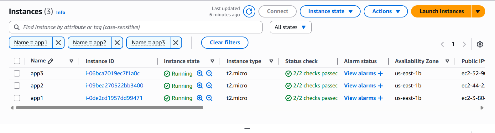

# Terraform Meta Arguments

This project is part of my Ironhack DevOps & Cloud Computing Bootcamp. Here I explored **Terraform meta arguments** to build AWS resources in a more flexible and controlled way. Think of it like adding “special powers” to Terraform so it knows how and when to create stuff, not just what to create.  

---

## 📋 What This Lab Covers

- `depends_on` → control creation order of resources

- `count` → spin up multiple instances quickly  

- `for_each` → create resources dynamically from lists or maps 

- `lifecycle` → prevent accidental deletion or control update behavior 

- `provider` → deploy to multiple regions with different configs  

- `provisioner` → run commands after a resource is created  

- `connection` → define SSH access for provisioners  

---

## ⚡ My Setup

- **Cloud Provider**: AWS 

- **IaC Tool**: Terraform 

- **OS**: Ubuntu on WSL2  

- **Editor**: VS Code  

---

## 🧩 Challenges & How I Solved Them

| Could not change permissions on `.pem` file in `/mnt/c/...` 

- Copied `.pem` file into Linux home directory and ran `chmod 400` there 

| SSH key "Permission denied"

- Checked file path, permissions, and used correct `ssh -i` syntax |

| Remembering syntax for `for_each` 

- Used Terraform docs & tested with a small example before applying to main config 

---

## 📚 What I Learned

- Meta arguments are not about creating new resources but controlling **how** Terraform manages them. 

- `for_each` is more flexible than `count` because it works with maps and sets.  

- Always handle `.pem` keys inside Linux home directory to avoid permission issues.  

- Good tagging and resource naming makes AWS console easier to navigate.  

---

## 📸 Screenshots

Terraform apply output:  

---

## 🏷 Tags
Terraform · AWS · DevOps · Infrastructure-as-Code · Meta-Arguments

---

👨‍💻 **Author**: Donatus — Junior DevOps Engineer & Cloud Enthusiast   
